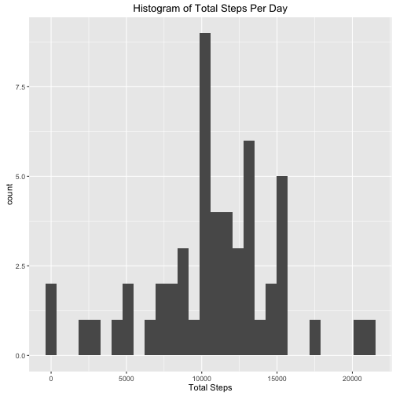
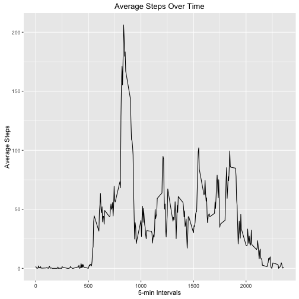
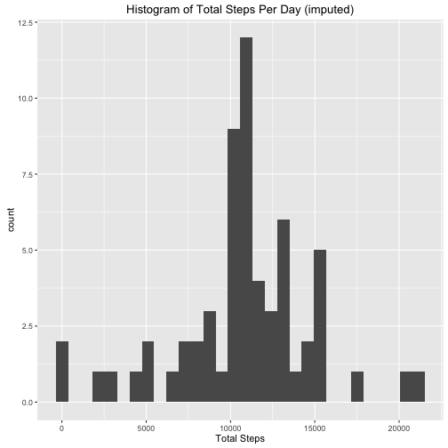
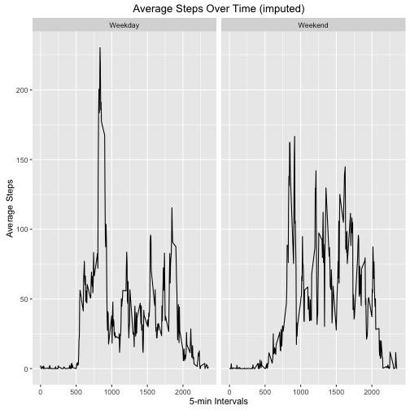

Loading and preprocessing the data
==================================
Show any code that is needed to

1. Load the data (i.e. 𝚛𝚎𝚊𝚍.𝚌𝚜𝚟())
2. Process/transform the data (if necessary) into a format suitable for your analysis

```r
activity<-read.csv("activity.csv")

activity$date<-as.Date(as.character(activity$date), "%Y-%m-%d")
##convert the day column to a date variable

str(activity)
```

```
## 'data.frame':	17568 obs. of  3 variables:
##  $ steps   : int  NA NA NA NA NA NA NA NA NA NA ...
##  $ date    : Date, format: "2012-10-01" "2012-10-01" ...
##  $ interval: int  0 5 10 15 20 25 30 35 40 45 ...
```

What is mean total number of steps taken per day?
=================================================

For this part of the assignment, you can ignore the missing values in the dataset.

1. Calculate the total number of steps taken per day


```r
suppressMessages(library(dplyr))
library(ggplot2)
```


```r
steps<- activity %>%
  filter(!is.na(steps)) %>%
          group_by(date) %>%
          summarize(
            total_steps=sum(steps)
        ) 
head(steps)
```

```
## # A tibble: 6 × 2
##         date total_steps
##       <date>       <int>
## 1 2012-10-02         126
## 2 2012-10-03       11352
## 3 2012-10-04       12116
## 4 2012-10-05       13294
## 5 2012-10-06       15420
## 6 2012-10-07       11015
```

2. Make a histogram of the total number of steps taken each day
3. Calculate and report the mean and median of the total number of steps taken per day


```r
ggplot(data=steps)+
  geom_histogram(mapping=aes(x=total_steps, binwidth=5))+
  labs(title="Histogram of Total Steps Per Day", x="Total Steps")
```



```r
mean(steps$total_steps)
```

```
## [1] 10766.19
```

```r
median(steps$total_steps)
```

```
## [1] 10765
```

 What is the average daily activity pattern?
============================================
 
 1. Make a time series plot (i.e. 𝚝𝚢𝚙𝚎 = "𝚕") of the 5-minute interval (x-axis) and the average number of steps taken, averaged across all days (y-axis)
 
 2.Which 5-minute interval, on average across all the days in the dataset, contains the maximum number of steps?


```r
steps2<- activity %>%
  filter(
    !is.na(steps)
    ) %>%
  group_by(interval) %>%
  summarize(
    avg_steps=mean(steps)
    ) 

ggplot(data=steps2)+
  geom_line(mapping=aes(x=interval, y=avg_steps))+
  labs(title="Average Steps Over Time", 
    y="Average Steps",x="5-min Intervals")
```



```r
(steps2 %>%
    arrange(desc(avg_steps)))
```

```
## # A tibble: 288 × 2
##    interval avg_steps
##       <int>     <dbl>
## 1       835  206.1698
## 2       840  195.9245
## 3       850  183.3962
## 4       845  179.5660
## 5       830  177.3019
## 6       820  171.1509
## 7       855  167.0189
## 8       815  157.5283
## 9       825  155.3962
## 10      900  143.4528
## # ... with 278 more rows
```

We can see that the highest number of steps was during the 835th interval.

Imputing missing values
=======================

Note that there are a number of days/intervals where there are missing values (coded as 𝙽𝙰). The presence of missing days may introduce bias into some calculations or summaries of the data.

1. Calculate and report the total number of missing values in the dataset (i.e. the total number of rows with 𝙽𝙰s)

2. Devise a strategy for filling in all of the missing values in the dataset. The strategy does not need to be sophisticated. For example, you could use the mean/median for that day, or the mean for that 5-minute interval, etc.

3. Create a new dataset that is equal to the original dataset but with the missing data filled in.

4. Make a histogram of the total number of steps taken each day and Calculate and report the mean and median total number of steps taken per day. Do these values differ from the estimates from the first part of the assignment? What is the impact of imputing missing data on the estimates of the total daily number of steps?


```r
sum(is.na(activity)) ##total number of missing values
```

```
## [1] 2304
```

```r
activity$steps[is.na(activity$steps)]<-
          tapply(activity$steps,activity$interval,mean,na.rm=TRUE)
##impute the mean for each time interval for missing values and add column to original dataset

steps<- activity %>%
  group_by(date) %>%
  summarize(
    total_steps=sum(steps, na.rm=TRUE)
            ) 

ggplot(data=steps)+
  geom_histogram(mapping=aes(x=total_steps, binwidth=5))+
labs(title="Histogram of Total Steps Per Day (imputed)", x="Total Steps")
```



```r
mean(steps$total_steps)
```

```
## [1] 10766.19
```

```r
median(steps$total_steps)
```

```
## [1] 10766.19
```

Accoridng to the histogram the distribution has more obervations around its mean. This makes sense since I performed a simple mean imputation.The mean and the median are now equal after imputation.

Differences in activity patterns between weekdays and weekends?
==============================================================

1. Create a new factor variable in the dataset with two levels – “weekday” and “weekend” indicating whether a given date is a weekday or weekend day.

2. Make a panel plot containing a time series plot of the 5-minute interval (x-axis) and the average number of steps taken, averaged across all weekday days or weekend days (y-axis). See the README file in the GitHub repository to see an example of what this plot should look like using simulated data.


```r
flag<-
      activity %>%
        mutate(day=weekdays(date)) %>%
        mutate(
                day2=ifelse(
        grepl("Saturday",day),"Weekend",
                      ifelse(
        grepl("Sunday",day), "Weekend", "Weekday")))

to_plot<-
            flag %>%
          group_by(interval, day2) %>%
          summarize(avg_day=mean(steps))

ggplot(data=to_plot)+
  geom_line(mapping=aes(x=interval, y=avg_day))+
  facet_grid(.~day2)+
  labs(title="Average Steps Over Time (imputed)", 
       y="Average Steps",x="5-min Intervals")
```



 
